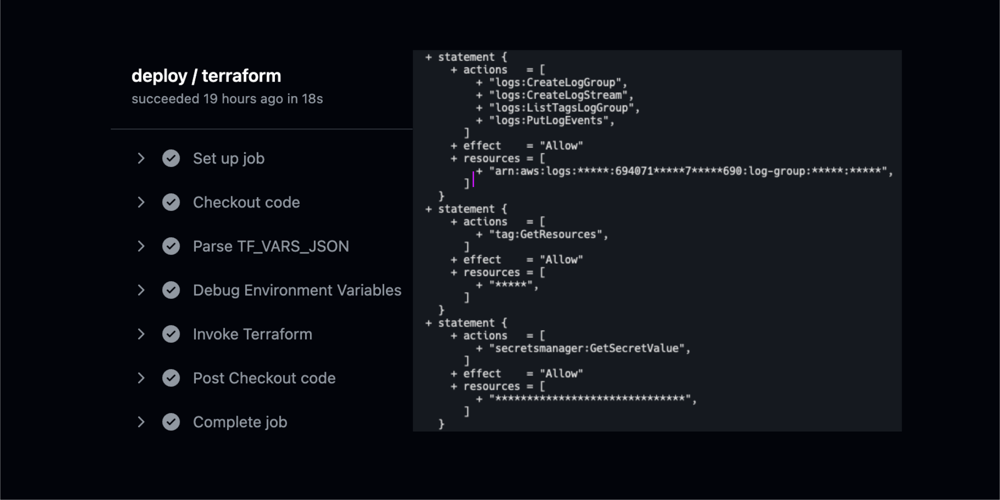

# AWS Terraform CI/CD
Welcome to the AWS Terraform CI/CD documentation!

This guide provides a comprehensive overview of setting up Continuous Integration and Continuous Deployment (CI/CD) workflows for deploy AWS infra via Terraform.

## Workflow Overview

The  workflow is responsible for building Rust projects across multiple platforms and architectures. It discovers crates, caches dependencies, and produces build artifacts.

The workflow defined in [aws-terraform.yml](https://github.com/Mad-Pixels/github-workflows/blob/main/.github/workflows/aws-terraform.yml) simplifies and secures Terraform operations using the [ci-actions](https://github.com/Mad-Pixels/ci-actions) project. This project acts as a wrapper for executing Terraform commands while masking sensitive information, ensuring the safety and confidentiality of secrets and variables.

This workflow supports common Terraform operations such as plan and apply, with configurable parameters and secure integration with AWS.

### Workflow configuration

#### Inputs
| Input Name            | Required | Default     | Description                                                 |
|-----------------------|----------|-------------|-------------------------------------------------------------|
| `terraform_version`   | 🔴       | `1.6.1`     | The Terraform version to be used in the workflow.           |
| `terraform_command`   | 🟢       | -           | The Terraform command to execute (e.g., `plan`, `apply`).   |
| `terraform_workspace` | 🔴       | -           | The Terraform workspace to use.                             |
| `working_directory`   | 🔴       | `terraform` | The directory containing the Terraform configuration files. |
| `actions_verions`     | 🟢       | -           | The version of the CI-action Docker image to use.           |

#### Secrets
| Input Name                     | Required | Description                                                        |
|--------------------------------|----------|--------------------------------------------------------------------|
| `AWS_ACCESS_KEY_ID`            | 🟢       | AWS access key ID for authentication.                              |
| `AWS_SECRET_ACCESS_KEY`        | 🟢       | AWS secret access key for authentication.                          |
| `AWS_SESSION_TOKEN`            | 🔴       | AWS session token (if temporary credentials are used).             |
| `TERRAFORM_BACKEND_REGION`     | 🟢       | AWS region of the S3 bucket used for the Terraform backend.        |
| `TERRAFORM_BACKEND_BUCKET`     | 🟢       | Name of the S3 bucket for the Terraform backend.                   |
| `TERRAFORM_BACKEND_KEY`        | 🟢       | Key (file path) in the S3 bucket to store the Terraform state.     |
| `TERRAFORM_BACKEND_KMS_KEY_ID` | 🔴       | AWS KMS key ID for encrypting the Terraform state.                 |
| `TERRAFORM_BACKEND_ROLE_ARN`   | 🔴       | IAM role ARN to assume for accessing the Terraform backend.        |
| `TERRAFORM_BACKEND_PROFILE`    | 🔴       | AWS profile to use for accessing the Terraform backend.            |
| `TF_VARS_JSON`                 | 🔴       | A JSON object containing variables for Terraform in TF_VAR_ format.|

#### TF_VARS_JSON

> To ensure masking works correctly and does not conflict with GitHub's masking mechanism (which hides the entire output when a secret is found in a line), it is recommended to use a single secret in JSON format for all required `TF_VAR_` variables in the project. This approach allows Terraform variables to be passed securely without risking accidental exposure.

Valid formats:

- With the `TF_VAR_` prefix:

```json
{
  "TF_VAR_project": "my_project",
  "TF_VAR_aws_region": "us-east-1"
}
```

- Without the TF_VAR_ prefix (the prefix will be added automatically during processing):
```json
{
  "project": "my_project",
  "aws_region": "us-east-1"
}
```
Using a single JSON secret prevents GitHub's built-in masking processes, ensuring the workflow functions correctly.

## Using Workflow example

1. Prepare project secrets
2. Prepare `TF_VAR_*` as single secret in JSON format.

```yml
name: Release

on:
  push:
    tags:
      - "v[0-9]+.[0-9]+.[0-9]+"

jobs:
  deploy:
    uses: Mad-Pixels/github-workflows/.github/workflows/aws-terraform.yml@main
    with:
      terraform_command: apply
      working_directory: "terraform/provisioners/infra/"
    secrets:
      AWS_ACCESS_KEY_ID: ${{ secrets.AWS_ACCESS_KEY }}
      AWS_SECRET_ACCESS_KEY: ${{ secrets.AWS_SECRET_KEY }}

      TERRAFORM_BACKEND_REGION: ${{ secrets.AWS_BACKEND_REGION }}
      TERRAFORM_BACKEND_BUCKET: ${{ secrets.AWS_BACKEND_BUCKET }}
      TERRAFORM_BACKEND_KEY: ${{ secrets.AWS_BACKEND_KEY }}

      TF_VARS_JSON: ${{ secrets.TF_VARS_JSON }}
```

#### Result

> With additional maskers for AWS output.


