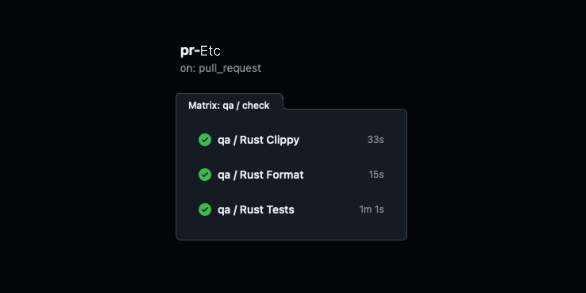
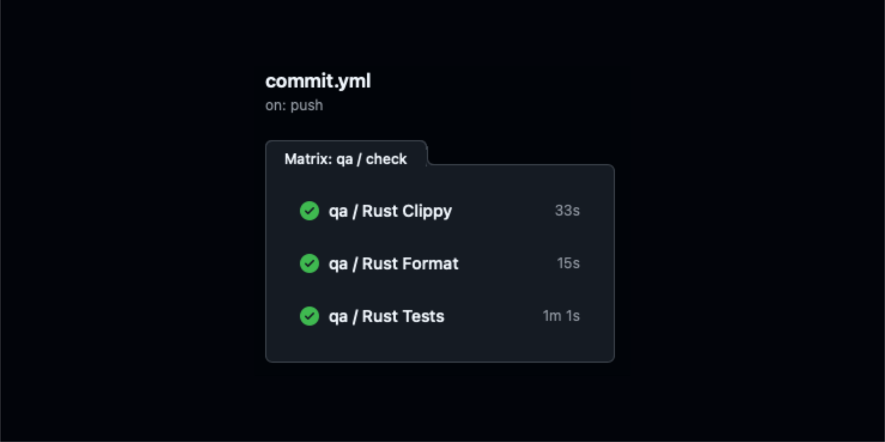
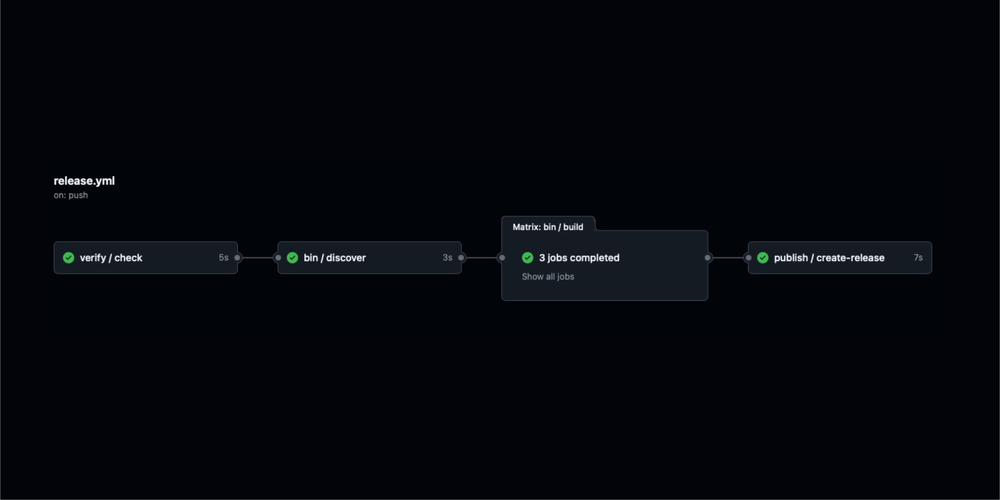

# Rust CI/CD
Welcome to the Rust CI/CD documentation!

This guide provides a comprehensive overview of setting up Continuous Integration and Continuous Deployment (CI/CD) workflows for Rust projects using GitHub Actions.

## Workflow Overview
### Rust Build
The [rust-build.yml](https://github.com/Mad-Pixels/github-workflows/blob/main/.github/workflows/rust-build.yml) workflow is responsible for building Rust projects across multiple platforms and architectures. It discovers crates, caches dependencies, and produces build artifacts.

#### Key Features:
- Multi-platform Builds: Supports Linux (x86_64 and aarch64) and macOS (arm64).
- Dependency Caching: Utilizes GitHub Actions cache to speed up builds.
- Artifact Management: Collects and uploads build artifacts for further use.

#### Intputs:
| Input Name        | Required | Default     | Type   | Description                      |
|-------------------|----------|-------------|--------|----------------------------------|
| working-directory | No       | ""          | String | Directory containing Rust project|
| crates-path       | No       | ""          | String | Path to binary crates directory  |

### Rust Checks
The [rust-check.yml](https://github.com/Mad-Pixels/github-workflows/blob/main/.github/workflows/rust-check.yml) workflow focuses on code quality and integrity by running tests, formatting checks, and linting using Clippy.

#### Key Features:
- Comprehensive Checks: Runs tests, formatting checks, and Clippy linting.
- Parallel Execution: Executes checks in parallel to reduce CI time.
- Failure Handling: Cleans caches upon failure to ensure consistent state.

#### Intputs:
| Input Name        | Required | Default     | Type   | Description                      |
|-------------------|----------|-------------|--------|----------------------------------|
| working-directory | No       | ""          | String | Directory containing Rust project|

### GitHub Tag Check (General flow)
The [github-check-tag.yml](https://github.com/Mad-Pixels/github-workflows/blob/main/.github/workflows/github-check-tag.yml) workflow verifies whether the pushed tag originates from the main branch.

#### Key Features:
- Branch Verification: Checks if the tag is associated with the main branch.
- Output Handling: Provides an output (is_main) to conditionally execute subsequent jobs.

### GitHub Release (general flow)
Triggers on pushes that create version tags following the semantic versioning pattern (e.g., `v1.2.3`).

#### Key Features:
- Tag Verification: Ensures that releases are only created from the main branch.
- Add artifacts: Add artifacts to release.
- Release Publishing: Creates a GitHub release with the generated artifacts.
Release Publishing: Creates a GitHub release with the generated artifacts.

## Using Workflows
The workflows [rust-build.yml](https://github.com/Mad-Pixels/github-workflows/blob/main/.github/workflows/rust-build.yml) and [rust-check.yml](https://github.com/Mad-Pixels/github-workflows/blob/main/.github/workflows/rust-check.yml) can be reused across different CI/CD scenarios. Below are examples of how to integrate these workflows into your project.

### Pull Request (main)
Triggers on pull requests targeting the main branch and includes both quality checks and build processes.


```yaml
name: PR Main

on:
  pull_request:
    types: [opened, synchronize, reopened]
    branches:
      - main

jobs:
  qa:
    uses: Mad-Pixels/github-workflows/.github/workflows/rust-check.yml@main
    with:
      working-directory: "./actions"
  
  bin:
    needs: qa
    uses: Mad-Pixels/github-workflows/.github/workflows/rust-build.yml@main
    with:
      working-directory: "./actions"  # Directory containing Rust project
      crates-path: "bin"              # Path to binary crates directory
```

### Pull Request (other, etc)
Triggers on pull requests targeting non-main branches.



```yaml
name: PR Etc

on:
  pull_request:
    types: [opened, synchronize, reopened]
    branches-ignore:
      - main

jobs:
  qa:
    uses: Mad-Pixels/github-workflows/.github/workflows/rust-check.yml@main
    with:
      working-directory: "./actions"  # Directory containing Rust project
```

### On Commint
Triggers on pushes to branches other than main, focusing on changes within the actions directory.



```yaml
name: Commit

on:
  push:
    branches-ignore:
      - main
    paths:
      - "actions/**.rs"
      - "actions/**/Cargo.toml"
      - "actions/**/Cargo.lock"

jobs:
  qa:
    uses: Mad-Pixels/github-workflows/.github/workflows/rust-check.yml@main
    with:
      working-directory: "./actions"  # Directory containing Rust project
```

### Release
Triggers on pushes that create version tags following the semantic versioning pattern (e.g., v1.2.3). This workflow verifies the tag, builds binaries, and publishes a GitHub release with the artifacts.



```yaml
name: Release

on:
  push:
    tags:
      - "v[0-9]+.[0-9]+.[0-9]+"

jobs:
  verify:
    uses: Mad-Pixels/github-workflows/.github/workflows/github-check-tag.yml@main

  bin:
    needs: verify
    if: needs.verify.outputs.is_main == 'true'
    uses: Mad-Pixels/github-workflows/.github/workflows/rust-build.yml@main
    with:
      working-directory: "./actions"  # Directory containing Rust project
      crates-path: "bin"              # Path to binary crates directory

  publish:
    needs: [verify, bin]
    if: needs.verify.outputs.is_main == 'true'
    uses: Mad-Pixels/github-workflows/.github/workflows/github-release.yml@main
    with:
      tag: ${{ github.ref_name }}
```